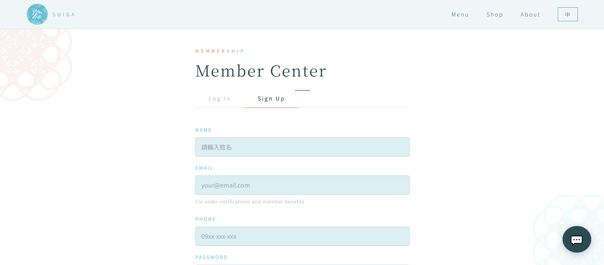
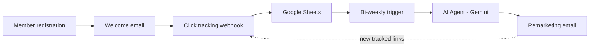
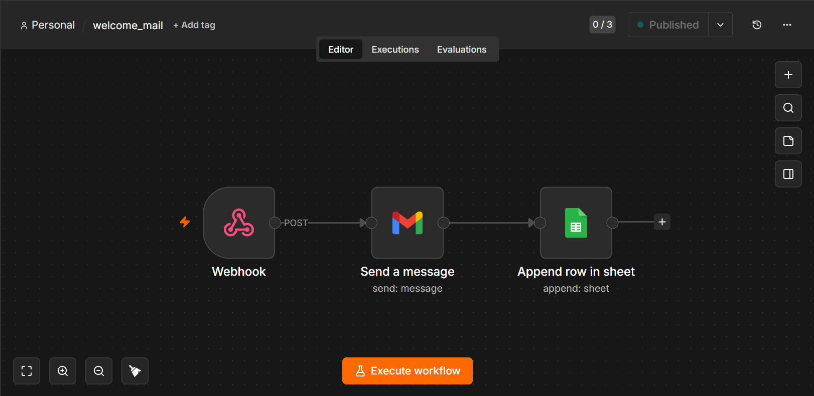
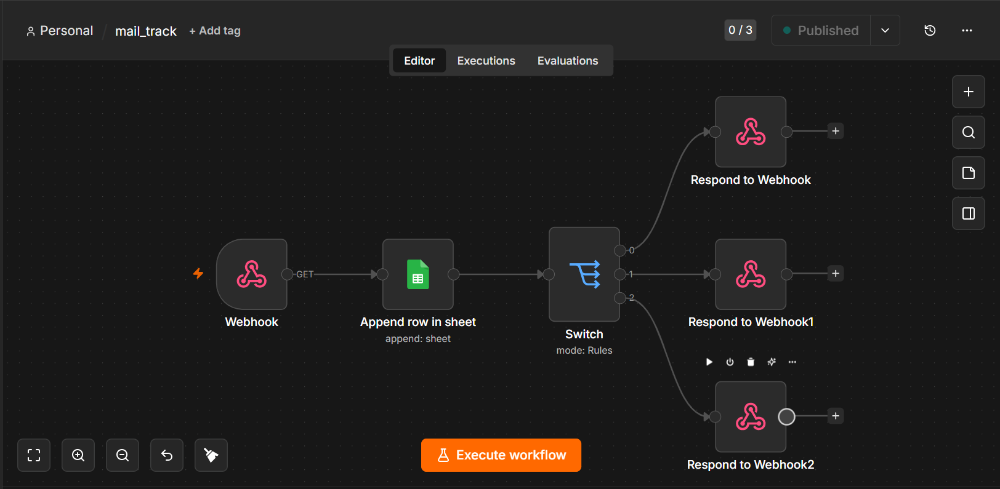
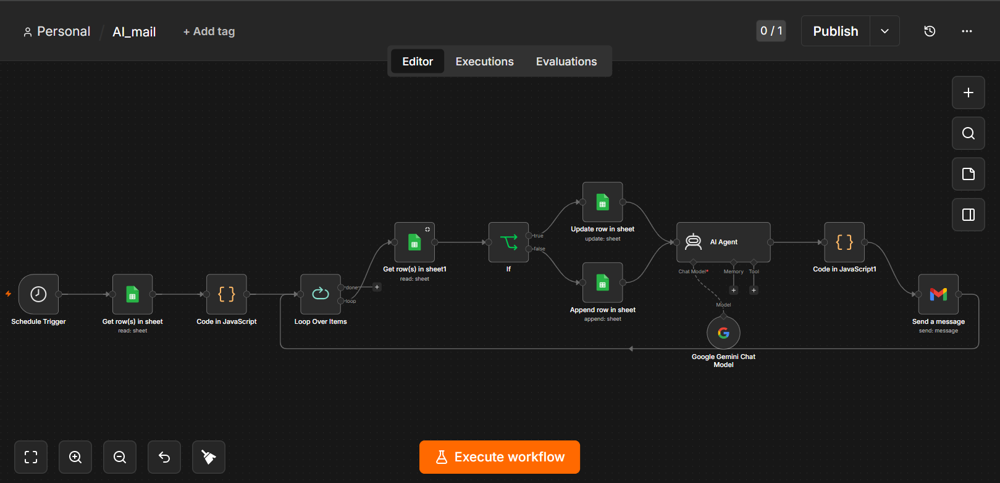
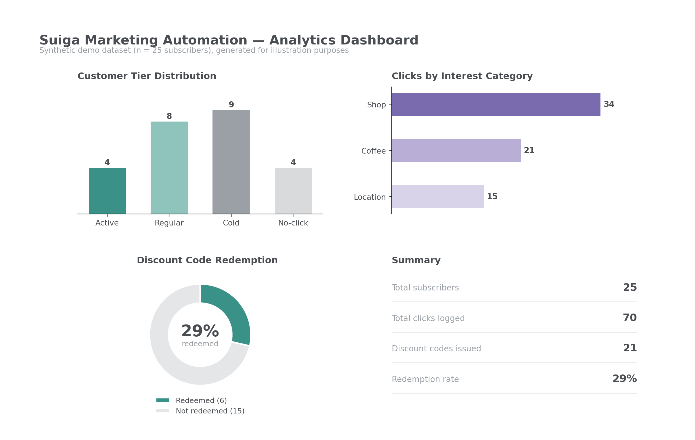

# End-to-End Email Marketing Automation

A reusable email marketing automation architecture for small retail and F&B brands — member onboarding, interest-based click tracking, tiered customer segmentation, and AI-personalized remarketing. Suiga, a fictional vintage-style select shop and café, serves as the demonstration case.

> Developed as a term project for *Internet Marketing* at National Taipei University (June 2026), which required designing and deploying a working marketing automation system.

## At a glance

| Item | Detail |
|---|---|
| Automated workflows | 3 (Welcome Email / Click Tracking / Bi-weekly AI Remarketing) |
| Integrated services | Google Sheets, Gemini API |
| Tracking scope | Email-based, interest-tagged links |
| Segmentation | 3-tier customer scoring by click frequency |
| Conversion tracking | Unique discount code per subscriber |

## Business problem

Small retail and F&B brands typically run marketing communication manually, with no system to distinguish an engaged customer from a dormant one, and no signal on individual interest. Two gaps drive the design:

- Every subscriber receives identical follow-up regardless of engagement level.
- No mechanism ties email engagement to actual purchase behavior — opens and clicks measure attention, not revenue.

## Website foundation

The member-facing website is built on WordPress: registration page, member area, and product/content pages. Its role is scoped deliberately — it is the entry point and identity anchor for the automation layer.

## System architecture

Onboarding runs once; click tracking, bi-weekly evaluation, and AI remarketing then form a recurring loop, with each remarketing email seeding the next cycle's tracking data.

## Workflow breakdown

### 1. Welcome email

- **Trigger:** Webhook, called on registration form submission from the WordPress member page.
- **Logic:** The workflow sends a formatted welcome email, then appends the subscriber's record (email, name, phone, registration timestamp) to the member sheet.
- **Output:** Subscriber onboarded and eligible for click tracking.

### 2. Click tracking

- **Trigger:** Subscriber clicks a link inside a marketing email. Links are tagged by interest category (`shop`, `coffee`, `location`), not raw URLs.
- **Logic:** A webhook receives the click event and appends timestamp, subscriber email, and interest category to a tracking sheet. A Switch node then branches on the interest category, redirecting the subscriber to the corresponding page — the click is logged and resolved in a single round trip.
- **Output:** A behavioral log of what each subscriber engages with, not just whether they opened an email.

### 3. Bi-weekly AI remarketing

- **Trigger:** Scheduled run, every two weeks.
- **Logic:**
  1. Read the click tracking sheet and aggregate click history by interest category and total volume (Code node).
  2. Loop over each subscriber individually (Loop Over Items).
  3. Check the remarketing record sheet for an existing entry for that subscriber (If node):
     - **Existing subscriber (true)** — update their record: refresh tier and click stats, discount code carried over rather than reissued.
     - **New subscriber (false)** — append a new record: assign an initial tier and generate a discount code.
  4. Pass click-count-by-category and customer tier to an AI Agent node (Gemini as the underlying chat model), which generates the email body only.
  5. Assemble the final email: AI-generated body plus a fixed-format subject line and remarketing link, built in JavaScript in a Code node.
  6. Send the email.
- **Output:** Personalized, tier-aware remarketing emails with a built-in mechanism to measure actual conversion, not just engagement.

## AI integration

- **Model:** Gemini 2.5 Flash-Lite — chosen for low latency and cost efficiency on short-form email body generation.
- **Integration point:** n8n's native AI Agent node, keeping prompt construction, model configuration, and output handling within n8n's built-in AI tooling rather than a hand-rolled API call.
- **Credential management:** The Gemini API key is stored via n8n's Credential system, not embedded in node parameters.
- **Model input:** Per-subscriber click count by interest category, and customer tier.
- **Generation scope:** The AI Agent generates the email body only. Subject line and remarketing link follow a fixed format and are assembled separately in JavaScript, keeping structural elements — particularly the tracked link — outside the model's control.

## Results

| Metric | Role |
|---|---|
| Customer tier distribution | Segments subscribers by engagement level |
| Interest category breakdown | Drives content personalization |
| Discount redemption count | Confirms revenue impact, not just engagement |
| Manual marketing effort | Reduced from per-send manual work to a one-time workflow build |

Current figures reflect a pilot cohort during initial deployment.

*Dashboard built from synthetic demo data (n = 25 subscribers) to illustrate the reporting output; it mirrors the aggregation logic implemented in the underlying Google Sheets.*

## Technical stack

| Layer | Tool |
|---|---|
| Website / member entry | WordPress (self-hosted, XAMPP) |
| Workflow automation | n8n |
| Data store | Google Sheets |
| AI content generation | Gemini 2.5 Flash-Lite, n8n AI Agent node |
| Trigger types | Webhook (click events), Schedule (bi-weekly remarketing) |

## Scope and limitations

- Tracking is email-based only. There is no on-site behavioral tracking — interest signals come entirely from which links a subscriber clicks inside emails.
- The system currently runs on a small pilot cohort. Tier thresholds and remarketing cadence are configurable but not yet validated at scale.
